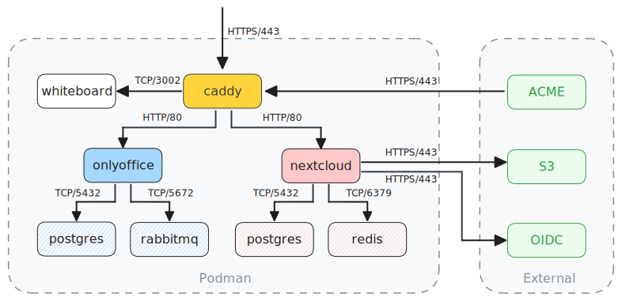

# Nextcloud Enclave

A Podman Nextcloud deployment for small to medium sized organizations.  


## Overview
What's different to other deployments out in the wild?

- BYO CA so you can connect to your internal services that are issued with your organizations certificates
- S3 is the primary data storage for nextcloud
- Caddy reverse proxy handles certificate management via ACME and terminates SSL
- OnlyOffice integrated
- Whiteboard integrated
- All containers are read-only except nextcloud and onlyoffice-documentserver
- All persistent data is written to named volumes
- All containers are network-isolated and only allowed required connections
- All containers have capabilities approriate to their tasks
- Hardened Chainguard containers for Postgres and Redis
- rootless through Podman
- Basic backup and restore functionality for Nextcloud


## Architecture



## Requirements

2 self-hosted or external services
- S3 storage
- ACME server
</br>

2 domains
- nextcloud.domain.tld
- onlyoffice.domain.tld


## CA trust
If you happen to run your own certificate authority (CA) your internal CA certificate must be present in `/etc/ssl/certs/ca-certificates.crt` on the container engine host. This file is bind-mounted into all containers that need trust to your CA (self-hosted services like OIDC server, S3, ACME, etc). 


### The Nextcloud CA trust problem

Nextcloud's entrypoint uses `rsync` to initialise `/var/www/html` on first boot. Bind-mounting files into that tree (such as `ca-bundle.crt` or `custom.config.php`) causes `rsync` to fail with `Device or resource busy` because it cannot rename over a mount point. The container will loop indefinitely.

Additionally, Nextcloud's Guzzle HTTP client ignores PHP's `curl.cainfo` setting. It hardcodes its own CA bundle at `/var/www/html/resources/config/ca-bundle.crt`. System `curl` inside the container will work fine while Nextcloud itself fails ...


`before-starting` hook scripts run after `rsync` completes, but before the web server starts, writing necessary configs to establish trust.


## Pre-installing apps 

`post-installation` hook scripts install the following apps 


- [onlyoffice](https://apps.nextcloud.com/apps/onlyoffice)
- [whiteboard](https://apps.nextcloud.com/apps/whiteboard)
- [oidc_login](https://apps.nextcloud.com/apps/oidc_login)
- [calendar](https://apps.nextcloud.com/apps/calendar)
- [contacts](https://apps.nextcloud.com/apps/contacts)
- [tasks](https://apps.nextcloud.com/apps/tasks)
- [notes](https://apps.nextcloud.com/apps/notes)
- [mail](https://apps.nextcloud.com/apps/mail)

Recommended Nextcloud apps (https://nextcloud.domain.tld/index.php/core/apps/recommended) are installed, with exception to Nextcloud Talk and Nextcloud Office/Collabora. An addition to this list is the oidc_login and onlyoffice app. The official Nextcloud `user_oidc` requires `allow_local_remote_servers=true` to contact OIDC providers on private networks, which weakens Nextcloud's built-in SSRF protections. `oidc_login` works against internal providers without that trade-off.


### The half-automatic way
If JWT secrets for onlyoffice and whiteboard are configured (only) in their respective env files, you have to go to your Nextcloud instance and fill in these secrets for onlyoffice at https://nextcloud.domain.tld/settings/admin/onlyoffice and for whiteboard at https://nextcloud.domain.tld/whiteboard/

>**NOTE** Using JWT secrets in the post-installation scripts to auto-configure onlyoffice and whiteboard is basically broken. The scripts install, configure and enable the apps, but since the lack of ca trust during the entire installation phase (see CA trust above) both configurations are just pre-set. You are unfortunately still required to go to the two links above and click save, to apply and run the configuration.


## Deployment

```
git clone https://github.com/littleoffice/nextcloud_enclave.git
```

Change domain.tld in:
- configs/Caddyfile
- envs/nextcloud.env
- hooks/post-installation/onlyoffice.sh
- hooks/post-installation/board.sh

Change SECRET in:
- configs/nextcloud-redis.conf
- envs/nextcloud-postgres.env
- envs/nextcloud.env
- envs/onlyoffice-postgres.env
- envs/onlyoffice-rabbitmq.env
- envs/onlyoffice-documentserver.env

```
podman-compose up -d 
```

| Deployment | Time |
|---|---|
| Without apps | ~45 seconds
| With apps |  ~90 seconds

>**NOTE** Keep in mind that first logins can take a bit. Be patient


### OIDC 

The implementation is based on the official [Authentik integration](https://integrations.goauthentik.io/chat-communication-collaboration/nextcloud/). OIDC is added through a `before-starting` script, similarly like the CA trust is established. <br>
>**NOTE** If OIDC url, client id or secret are not set in `.envs/nextcloud.env`, the oidc installation is skipped entirely.


## Security

[SOPS](https://github.com/getsops/sops) with [age](https://github.com/FiloSottile/age) is the recommended way of handling
- configs/redis.conf
- envs/*.env

</br>

The pre-set options in the hookscripts to set secrets in Nextcloud is intentionally not used because it would make secret management unnecessarily more annoying. They are mostly there for documentation/testing purposes.


## Backup

>**WARNING**`neb.sh` backs up Nextclouds configuration, database, and installed apps. <b>It does not back up S3 data</b>. Object durability is the responsibility of your S3 layer. 
Restoring from neb.sh <u>requires</u> a matching S3 bucket state from a compatible point in time! Don't skip this part or you'll have a really bad time!


```
./neb.sh backup
```

```
./neb.sh restore /path/to/backup_dir
``` 


## Tested with

| Component | Software |
|---|---|
| Host OS| [Alpine Linux](https://alpinelinux.org/)
| Container Engine| [Podman](https://podman.io/)
| S3 Storage| [RustFS](https://rustfs.com/)
| CA/ACME service| [Step-CA](https://smallstep.com/)
| OIDC provider| [Authentik](https://goauthentik.io/)
| Office Suite | [OnlyOffice](https://www.onlyoffice.com/)
| Cloud Suite | [Nextcloud](https://nextcloud.com/)
## Special thanks
This project was made with the help of Claude and OpenAI.
